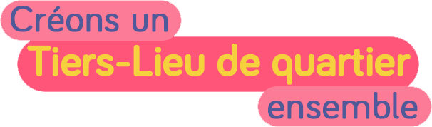
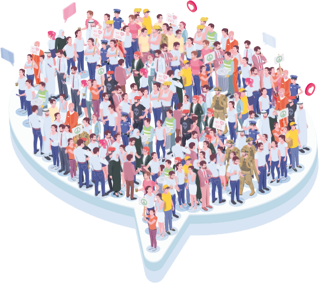

<div align="center">
  

### Un Tiers-Lieu de quartier,  c’est un lieu ouvert à tous pour se rencontrer, partager, travailler, se reposer, se divertir, créer du lien social…
  
Nous sommes un collectif d'habitants souhaitant créer un tiers-lieu de quartier en cohérence avec les attentes des habitants de St Augustin et des quartiers limitrophes.

    
  Cliquez ici pour accéder au [questionnaire](https://framaforms.org/creons-un-tiers-lieu-de-quartier-ensemble-1629557305)

  
  
 

  
  
  
  
  
  
  
  
  

 

[Link](url) and 
```

For more details see [GitHub Flavored Markdown](https://guides.github.com/features/mastering-markdown/).

### Jekyll Themes

Your Pages site will use the layout and styles from the Jekyll theme you have selected in your [repository settings](https://github.com/CecileAmey/lesbus/settings/pages). The name of this theme is saved in the Jekyll `_config.yml` configuration file.

### Support or Contact

Having trouble with Pages? Check out our [documentation](https://docs.github.com/categories/github-pages-basics/) or [contact support](https://support.github.com/contact) and we’ll help you sort it out.
